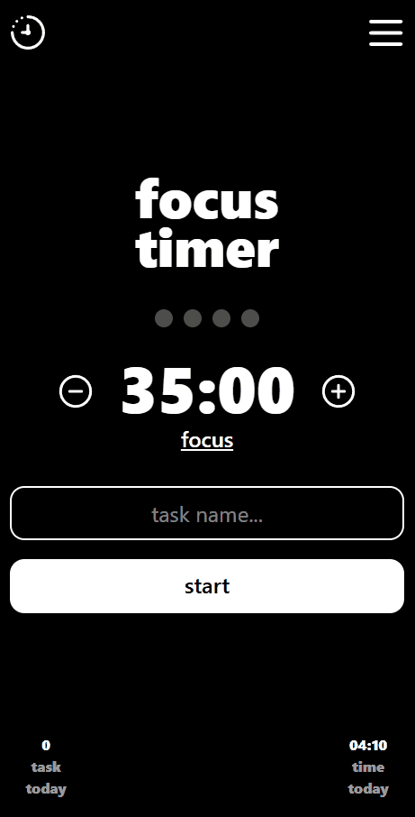
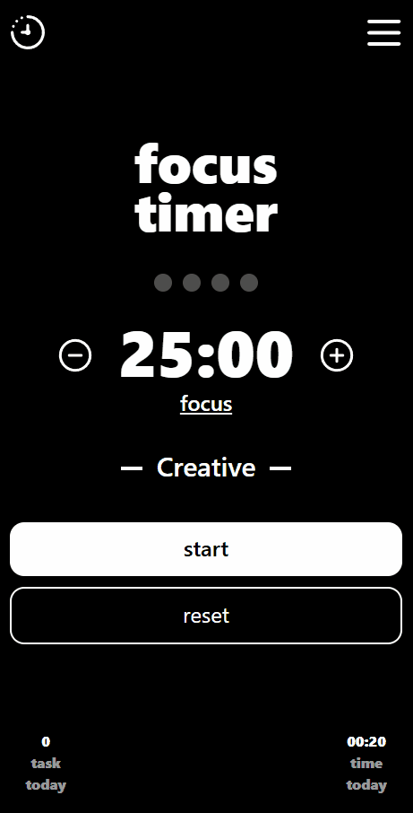
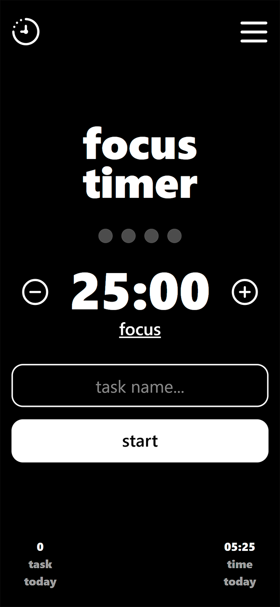
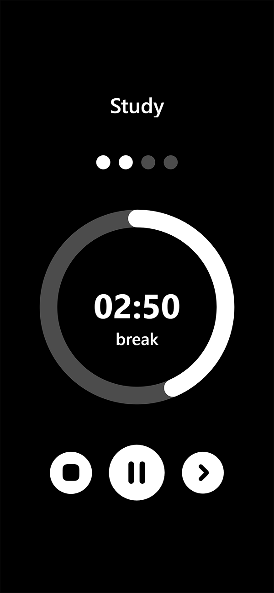
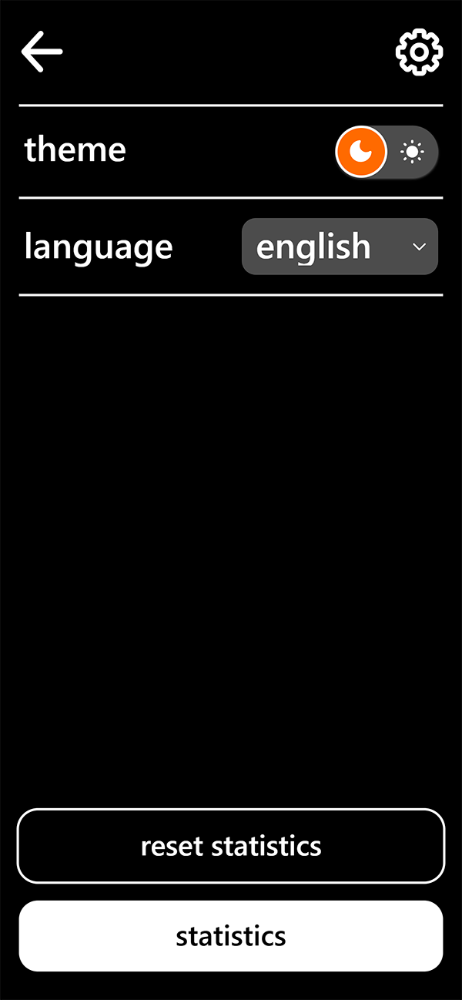

# focus-timer

Focus Timer / Pomodoro приложение: фокус-сессии, перерывы и базовая статистика.

## Краткое описание

- **Что это:** таймер для концентрации (фокус → короткий перерыв → … → длинный перерыв).
- **Для кого:** для работы/учёбы, когда нужно удерживать внимание и измерять прогресс.

## Демо проекта

[Открыть приложение](https://evgeniyredko.ru/focus-timer/)

| Таймер                                      | Настройки                                      | Статистика                                  |
| ------------------------------------------- | ---------------------------------------------- | ------------------------------------------- |
|  |  |  |

## Содержание

- [О проекте](#о-проекте)
- [Ключевые функции](#ключевые-функции)
- [Поддерживаемые платформы](#поддерживаемые-платформы)
- [Использование](#использование)
- [Скриншоты](#скриншоты)

## О проекте

**focus-timer** — приложение Pomodoro, помогающее работать «короткими рывками» и регулярно делать перерывы.

### Технологии

- Frontend: **Vite + React + TypeScript**
- UI: **Tailwind CSS**
- State management: **Redux Toolkit** (+react-redux)
- PWA: **vite-plugin-pwa** (manifest + service worker)
- Хранилище: **localStorage** (на стороне браузера)
- Уведомления: **Web Notifications API**

### Цели

- Снизить когнитивную нагрузку: фокусироваться на одной задаче в рамках короткого интервала.
- Дать простой ритуал работы: «запустить сессию» легче, чем «начать большую задачу».
- Поддерживать устойчивость: перерывы помогают не выгорать и сохранять качество работы.

### Термины

- **Фокус-сессия**: интервал целенаправленной работы.
- **Короткий перерыв**: короткая пауза между фокус-сессиями.
- **Длинный перерыв**: более длинная пауза после нескольких циклов.
- **Цикл**: последовательность «фокус → перерыв», повторяемая несколько раз до длинного перерыва.

## Ключевые функции

| Блок        | Функция                                      | Описание                                                                |
| :---------- | :------------------------------------------- | :---------------------------------------------------------------------- |
| Таймер      | Pomodoro-таймер (фокус/перерывы/циклы)       | Фазы **focus / short break / long break** + циклы до длинного перерыва. |
| Таймер      | Настройка длительности фаз (минуты)          | Настраиваются фокус/короткий/длинный перерыв и число циклов.            |
| Таймер      | Пауза/продолжить                             | Пауза не сбрасывает прогресс.                                           |
| Таймер      | Пропуск фазы / «далее»                       | Можно завершить фазу вручную и перейти дальше.                          |
| Таймер      | Сброс текущей сессии                         | Сбрасывает таймер и цикл до начального состояния.                       |
| Задачи      | Привязка таймера к задаче                    | Время фокус-сессии можно учитывать в «текущую задачу».                  |
| Статистика  | Сегодня: отработанное время                  | Суммарное время за день.                                                |
| Статистика  | Сегодня: количество завершённых циклов/задач | Например: завершённые задачи за день.                                   |
| Уведомления | Системные уведомления браузера/ОС            | Требует разрешение браузера/ОС.                                         |
| Уведомления | Звуки (старт/пауза/окончание)                | Звуки для ключевых действий.                                            |
| UX          | Темы оформления (light/dark/system)          | Поддержка системной темы.                                               |
| UX          | Локализация (RU/EN)                          | Минимальный словарь интерфейса.                                         |
| UX          | Горячие клавиши                              | Частично (например, Enter в поле ввода)                                 |

## Поддерживаемые платформы

- **Веб-приложение** (запускается в браузере).
- **PWA** (установка на устройство).

## Использование

### Пользовательский сценарий

1. Откройте приложение.
2. Введите название задачи.
3. Запустите фокус-сессию.
4. Работайте до окончания таймера.
5. Сделайте перерыв.
6. Повторяйте циклы до длинного перерыва.
7. Отслеживайте статистику

## Скриншоты

| Главный экран                                     | Таймер                                             | Настройки                                             |
| ------------------------------------------------- | -------------------------------------------------- | ----------------------------------------------------- |
|  |  |  |
